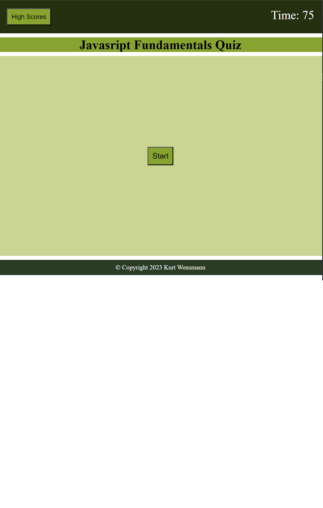

# 04 Web APIs: Code Quiz

## Start Button

* Create start button
* Make it disappear once hit until quiz is over
* Change it to "start over" when the quiz is finished
* Change to "start" to play again

## Timer

* Start timer when start is clicked
* Time is subtracted if answer is incorrect

## Questions

* Display question with possible answer as buttons
* When answer is clicked display 'correct' or 'incorrect' for 1 second
* Repeat until questions are displayed

## Results

* When all question are answered or timer reaches 0 game is over and an input field allows user to save name/initials to highscore

## High Scores

* Button to click on to display all the highscores
* High scores closes when clicked a second time

## Screenshot

## Deployed Page

* https://napoleondd86.github.io/coding-quiz/
